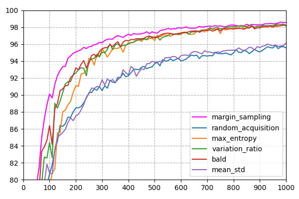

# Extending Bayesian Deep Learning with Image Data



Paper replication
```bash
python3 mini-project/bayes_cnn.py --a all
```

Minimal Extension
```bash
python3 mini-project/analytic.py --a analytic
python3 mini-project/analytic.py --a mfvi
```

Novel Extension
```bash
python3 mini-project/novel3.py --a margin_sampling
```
